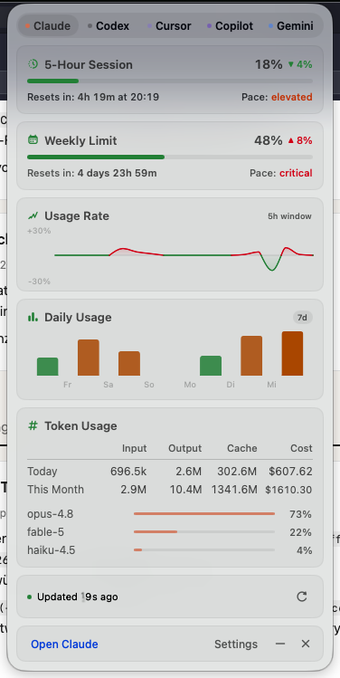
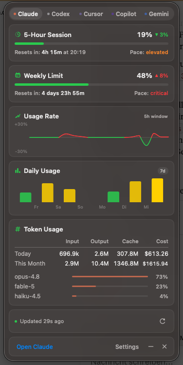

# Byte Pulse

AI usage in your Mac's menu bar — live rate limits, token counts, and costs for
**Claude, Codex, Cursor, GitHub Copilot, and Gemini**, read from the tools you
already use. A [Byte](https://byte.de) product. Swift + AppKit/SwiftUI, no
Electron, no accounts, no telemetry.

<p align="center">
  
  
</p>

## What you get

- **Menu bar stats** — compact per-provider blocks (session %, 1-hour trend);
  only providers active in the last 7 days take up space
- **Limit gauges** — 5-hour / weekly / monthly windows with reset countdowns
  and a pace verdict (safe · elevated · critical)
- **Usage rate** — how fast you're burning the current window (last 5h)
- **Histogram** — click the badge to switch 1 day (hourly) / 7d / 30d / 1 year
- **Token table** — Today & This Month × Input / Output / Cache / Cost, with a
  per-model breakdown
- Native macOS 26 look: vibrancy panel, light/dark palettes (accessible
  contrast in light mode), Reduce Motion respected

## Install

Requires **macOS 26+** (Apple Silicon) and **Xcode 26** for building.

```sh
git clone https://github.com/Byte-de/pulse.git && cd pulse
./scripts/build-app.sh --install   # builds, signs, installs /Applications/Pulse.app
open /Applications/Pulse.app
```

## Connecting providers

Pulse reads credentials that each tool already stores locally — sign in there
and the tab connects on the next refresh:

| Provider | Sign in via |
|---|---|
| Claude | Claude Code CLI (`claude`) |
| Codex | Codex CLI (`codex`) with a ChatGPT account |
| Cursor | Cursor app |
| Copilot | GitHub Copilot in any editor |
| Gemini | Gemini CLI (`gemini`) with Google sign-in |

## Privacy

Read-only by design: Pulse never writes or refreshes your CLI credentials and
talks **only** to each provider's own API — no third-party servers, no
telemetry. Costs shown for subscription plans are notional ($-equivalents
computed from token counts).

## Settings & shortcuts

Launch at login, refresh cadence (30s–5m), menu-bar style, and per-provider
toggles live in Settings (⌘,). In the panel: ←/→ or ⌘1–5 switch tabs, ⌘R
refreshes, esc or `–` minimizes, `×` quits.

## Custom icons

The UI uses SF Symbols out of the box. To use your own icon set, drop
single-color SVGs into `Sources/Pulse/Resources/Icons/` (see the name map in
`PulseIcons.swift`) and rebuild — licensed sets like Nucleo are intentionally
not bundled in this repo.

## Troubleshooting

- **Keychain dialog (Claude):** Pulse reads the `Claude Code-credentials` item
  through Apple's `security` tool so one approval survives rebuilds. Note that
  **"Always Allow" grants standing access to that item via the `security`
  tool**; click **"Allow"** for the stricter per-session posture — Pulse asks
  at most every 5 minutes.
- **"Not connected":** sign in with the provider's own tool first (table above).
- **No Dock icon:** by design — Pulse lives in the menu bar. Quit via `×`.

## License

MIT © 2026 Byte
